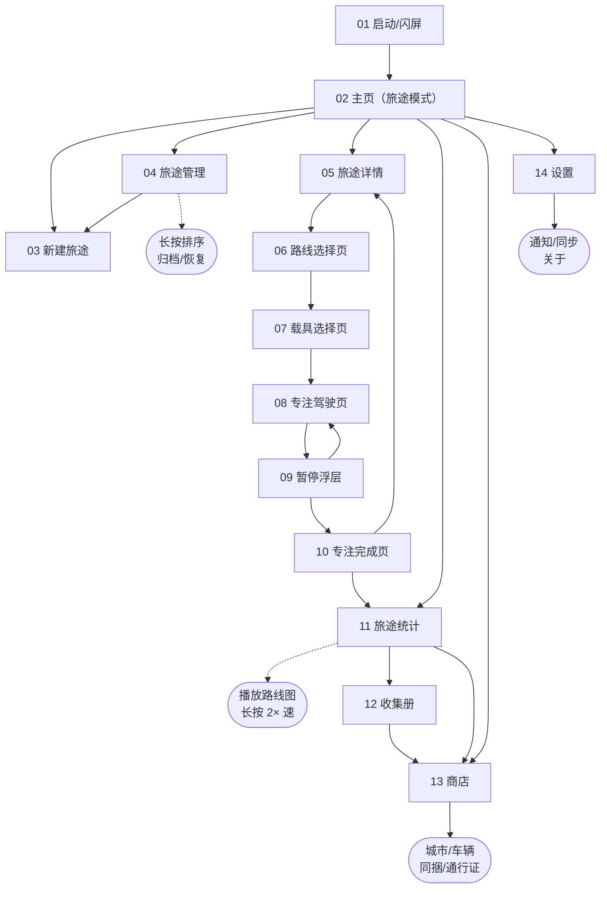

## 1. 产品定义
像素风驾驶专注计时器。用户创建「旅途」，选择真实城市间的驾驶路线进行专注。专注时横轴像素动画播放，完成路线即可解锁新城市并推进旅途。

---

## 2. 页面总览
| 编号 | 页面名称           | 说明 |
|------|--------------------|------|
| 01   | 启动/闪屏          | 2.5 s 像素动画 → 主页 |
| 02   | 主页（旅途模式）   | 显示当前活跃旅途、快捷继续 |
| 03   | 新建旅途           | 输入名称 + 选择起始城市 |
| 04   | 旅途管理           | 列表/归档；长按排序 |
| 05   | 旅途详情           | 已走路径、当前路线进度、开始专注 |
| 06   | 路线选择页         | 基于当前起点过滤；显示总时长 |
| 07   | 载具选择页         | 已拥有 / 可租赁 / 可抽取 |
| 08   | 专注驾驶页         | 横竖屏切换；阶段场景动画；HUD |
| 09   | 暂停浮层           | 继续 / 结束 |
| 10   | 专注完成页         | 判断路线完成；金币结算 |
| 11   | 旅途统计           | 时间轴路线动画；长按 2× 速 |
| 12   | 收集册             | 路线卡 & 载具卡图鉴 |
| 13   | 商店               | 城市/车辆/同捆包/通行证 |
| 14   | 设置               | 通知、数据同步、关于 |


---

## 3. 主要流程
1. 新建旅途 → 2. 选择路线 → 3. 选载具 → 4. 专注 → 5. 完成 → 6. 更新旅途终点  
路线完成条件：累计专注 ≥ 管理员配置的路线总时长。

---

## 4. 核心页面线框

### 04 旅途管理
```
┌────────────────────────────┐
│ 旅途管理           [编辑]   │
│                            │
│ 活跃                        │
│ ┌────────────┐             │
│ │毕业设计之旅│ 12h34m      │
│ └────────────┘             │
│ ┌────────────┐             │
│ │健身计划   │  3h05m      │
│ └────────────┘             │
│                            │
│ 归档                        │
│ ┌────────────┐             │
│ │考研复习   │ 25h50m      │
│ └────────────┘             │
│                            │
│ + 新建旅途                  │
└────────────────────────────┘
```
- 长按任意旅途可拖拽排序  
- 左滑归档 / 恢复  

### 05 旅途详情
```
┌────────────────────────────┐
│ < 毕业设计之旅              │
│ 曼彻斯特→利物浦→伯明翰       │
│ 总专注 12h34m               │
│ [播放路线图动画]            │
│                             │
│ 当前路线                    │
│ 伯明翰 → 伦敦   90 min      │
│ ━━━━━━━━━━━━━━━ 50%         │
│ 45 / 90 min                 │
│ [开始专注]                  │
│                             │
│ 已完成路径                  │
│ ● 曼→利 60 min ✔           │
│ ● 利→伯 75 min ✔           │
└────────────────────────────┘
```

### 08 专注驾驶页（竖屏 375×812）
```
┌────────────────────────────┐
│ 场景动画区 (375×380)        │
│                             │
│ 阶段切换动画：               │
│ 新场景自右向左滑入，         │
│ 旧场景自左消失（300 ms）    │
│                             │
├────────────────────────────┤
│ HUD 区 (375×220)            │
│ 伯明翰→伦敦  45/90 min      │
│ 00:25:17                    │
│ ┌──┐ ┌──┐                  │
│ │⏸️│ │🔄│                  │
│ └──┘ └──┘                  │
│ 天气：☔️                   │
└────────────────────────────┘
```
- 🔄 按钮：横竖屏切换  
- 天气实时读取（无加成）

### 11 旅途统计
```
┌────────────────────────────┐
│ 旅途统计 - 毕业设计之旅      │
│                             │
│ [路线图动画] 长按 2×速      │
│ 时间轴：                    │
│ 6-01 ━●━━━━━━━━ 6-30        │
│                             │
│ 周  12h ↑                   │
│ 月  45h ▇▇▇                │
│                             │
│ 路线完成 3/5                │
│ 车辆使用 8 辆               │
└────────────────────────────┘
```

---

## 5. 数据模型
```json
Journey {
  id: uuid
  name: string
  startCity: string
  currentCity: string
  totalMinutes: int
  isArchived: bool
  createdAt: datetime
}

Route {
  id: uuid
  fromCity: string
  toCity: string
  totalMinutes: int
  sceneStages: [int] // 素材索引
  price: int
}

Session {
  id: uuid
  journeyId: uuid
  routeId: uuid
  startAt: datetime
  endAt: datetime
  duration: int
  note: string
  harvestRating: int
  effortRating: int
  isRouteCompleted: bool
}
```

---

## 6. 金币 & 内购
- 专注 1 min = 1 金币  
- 路线完成奖励 = 30 金币  
- 用途：  
  1. 购买路线  
  2. 租赁载具（单条专注）  
  3. 抽载具（100/抽）  
- 内购：  
  – 城市解锁 ¥6-12  
  – 国家同捆包 ¥30（含 5 城）  
  – 车辆单买 ¥6-18 / 同捆 ¥25  
  – 季度通行证 ¥30（里程碑奖励租赁券、永久车辆、城市）

---

## 7. 像素素材规格
- 车辆 sprite：32×32 px，8 帧/方向  
- 路线背景：720×320 px，4 阶段 × 3 时段 = 12 png/路线  
- 天气层：雨滴/雪花 128×32 px 8 帧循环  
- UI 元件：按钮 3 态，像素字体 PressStart2P 10 pt

---

## 8. 开发里程碑（8 周）
1. 旅途数据模型 & 管理页  
2. 路线选择、阶段动画  
3. 专注驾驶横竖屏  
4. 完成页 & 路线完成判定  
5. 旅途统计时间轴动画  
6. 商店 & 通行证  
7. 内测  
8. 上线准备

---

## 9. 技术栈

技术栈参考（可直接落地）

---

### 一、跨平台框架  
Flutter 3.16（stable）  
- 语言：Dart 3.2  
- 原因：单一代码库输出 iOS / Android；官方 OrientationBuilder 支持横竖屏即时切换；CustomPainter 便于像素级绘制；StoreKit2 & Google Play Billing 官方插件已成熟。  

---

### 二、核心依赖列表  

| 功能 | 插件 / 库 | 版本锁定 |
|---|---|---|
| 状态管理 | riverpod 2.4 + riverpod_generator | ^2.4.5 |
| 本地数据库 | drift 2.15 (SQLite) | ^2.15.0 |
| 网络图片 & 缓存 | cached_network_image | ^3.3.1 |
| 内购 | in_app_purchase 3.1 | ^3.1.6 |
| 天气 API | dio 5.x + retrofit | ^5.4.0 |
| JSON 序列化 | json_annotation + build_runner | ^6.7.1 |
| 像素字体 | google_fonts | 任意 |

---

### 三、原生能力  

#### iOS  
- StoreKit2（Flutter 官方 in_app_purchase 已封装）  
- CoreLocation（仅城市定位，不追踪用户）  

#### Android  
- Google Play Billing Library 6.x  
- Fused Location Provider（城市级定位）  

---

### 四、构建 & CI/CD  

- 构建工具：Flutter build ipa / aab  
- 代码检查：very_good_analysis 规则集  
- CI：GitHub Actions  
  – flutter analyze + flutter test  
  – flutter build ios --release && flutter build appbundle  
  – 上传 TestFlight / Google Play Internal  


---

### 六、可选后端（首版可延后）

- aliyun function call
- postgreSql(用于存储通信证、购买记录、账户余额等信息)

---
